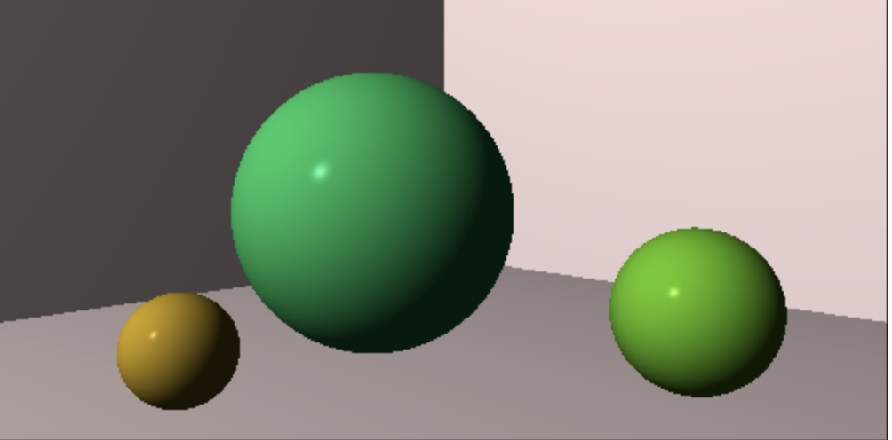

# Raytracer-challenge-react

A software rendered Ray Tracer implementation built and tested following Test Driven Development principles, based on the book [The Ray Tracer Challenge](https://www.amazon.co.uk/Ray-Tracer-Challenge-Jamis-Buck/dp/1680502719/ref=sr_1_1?crid=2ZX0VHMS63RXI&dib=eyJ2IjoiMSJ9.SNZdfJvTvQX_rorh0Nk65Q.pyQrJBAPDqTTRK_CiK18eWpgEgQXHfpkEB7y_xZ8ELk&dib_tag=se&keywords=ray+tracer+challenge&qid=1705573372&sprefix=raytrac%2Caps%2C63&sr=8-1).

This project utilises Web-workers in order to provide a real time view of the image being rendered. The worker is created and managed via a custom React hook. Which takes as arguments a function to run, and a list of dependencies for said function. This avoids the need to create a separate Java script file for the worker and allows for the importation of external functions.

In order to achieve an animated/procedural view of the scene being rendered the function provided to the hook takes as an argument a ```Uint8ClampedArray``` which is a view upon a ```SharedArrayBuffer```. This provides a fast way to communicate with the main thread and avoids expensive copy operations.

## Chapter 6 Challenge

Low resolution gif representing the image being rendered in realtime.


It is suggested to run the project locally for a higher resolution and smoother render output.

## Chapter 7 Challenge



### Running the project locally
To run the project locally checkout this repository and from the command line run.

```yarn start```

### Running the test suite
To run the tests from the command line run.

```yarn test```