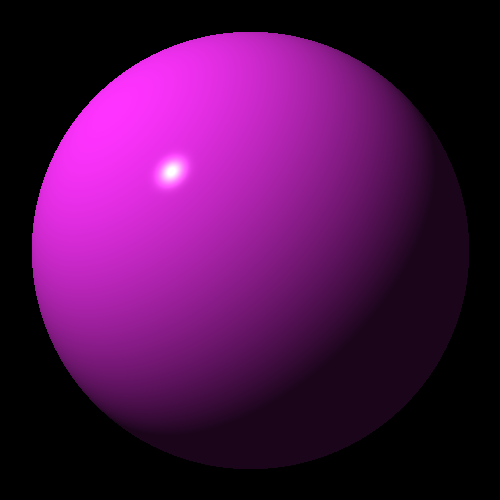
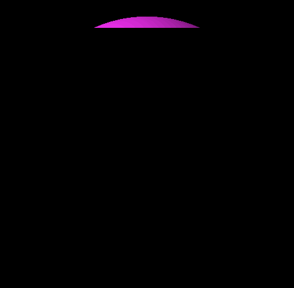

# Raytracer-challenge-react

A Raytracer implementation built and tested following Test Driven Development principles, based on the book [The Ray Tracer Challenge](https://www.amazon.co.uk/Ray-Tracer-Challenge-Jamis-Buck/dp/1680502719/ref=sr_1_1?crid=2ZX0VHMS63RXI&dib=eyJ2IjoiMSJ9.SNZdfJvTvQX_rorh0Nk65Q.pyQrJBAPDqTTRK_CiK18eWpgEgQXHfpkEB7y_xZ8ELk&dib_tag=se&keywords=ray+tracer+challenge&qid=1705573372&sprefix=raytrac%2Caps%2C63&sr=8-1).

This project utilises web-workers in order to provide a real time view of the image being rendered.

## Chapter 6 Challenge

Static rendered output.


Low resolution gif representing the image being rendered in realtime.


It is suggested to run the project locally for a higher resolution and smoother render output.

### Run project locally
To run the project locally checkout this repository and run.

```yarn start```